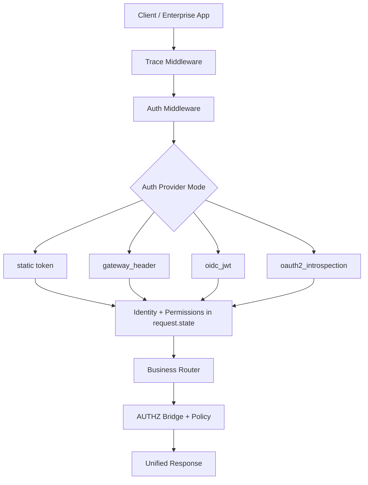
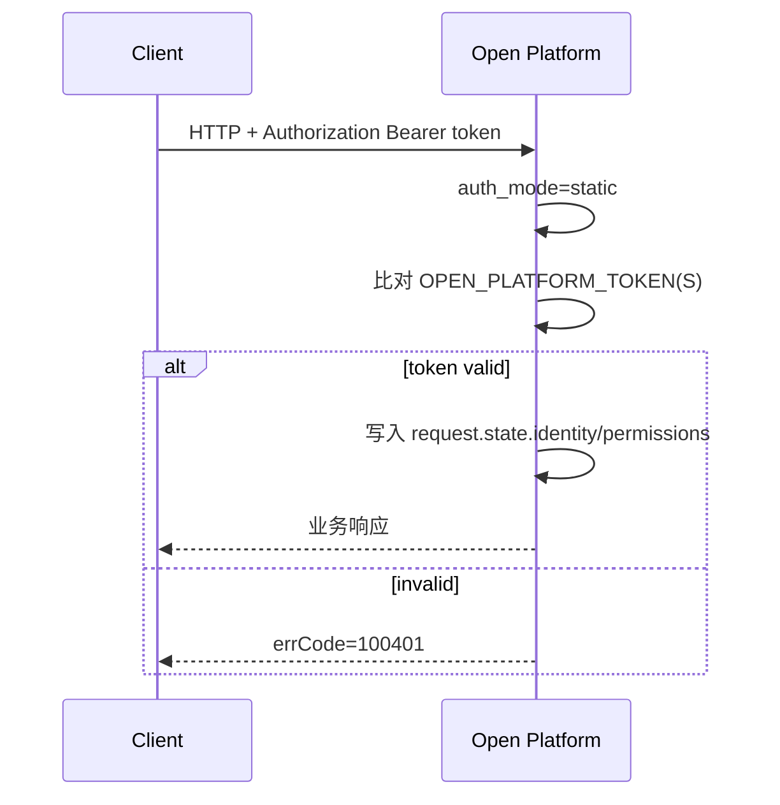
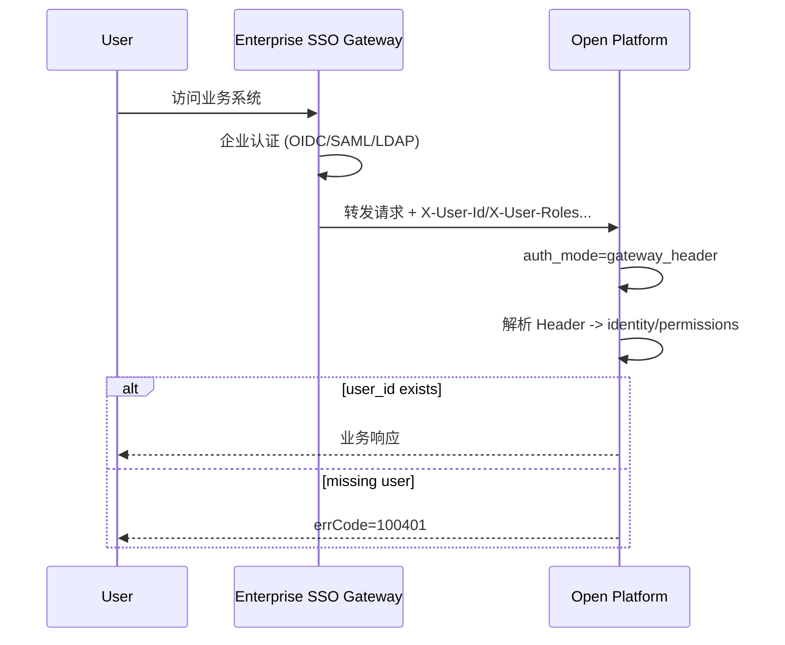
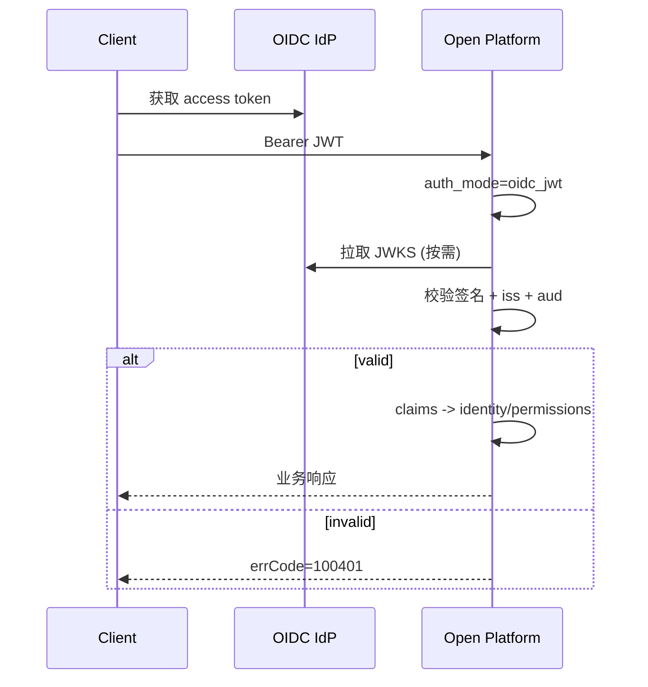
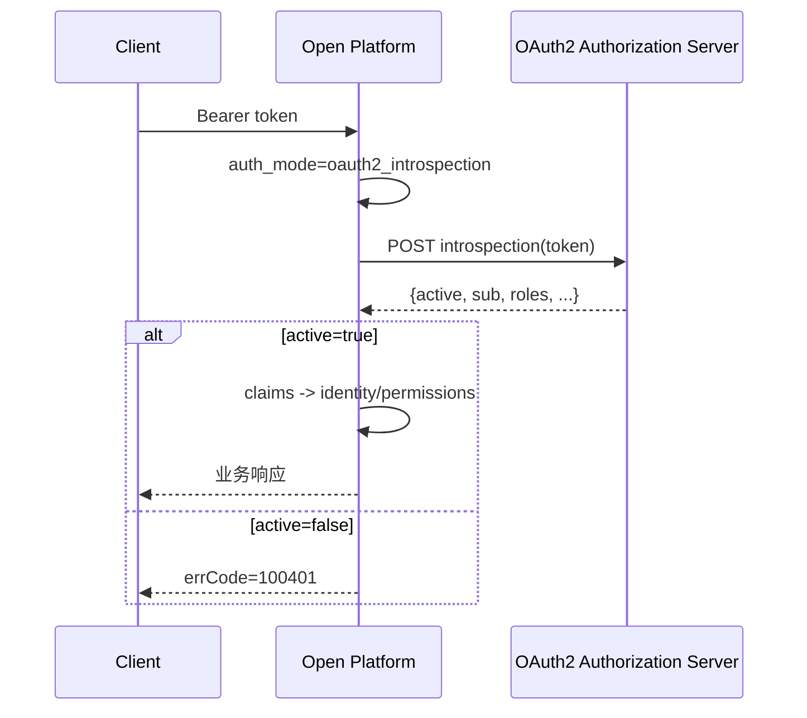
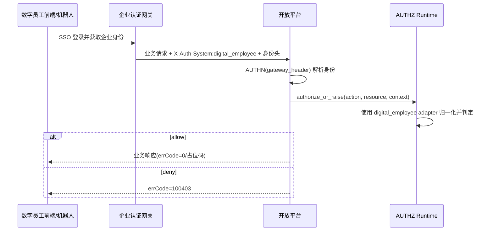

# 开放平台统一认证集成（OAuth2 / SSO）

本文档描述开放平台认证层（AUTHN）如何在不侵入现有业务与 AUTHZ 层的前提下，支持多种企业认证协议：

1. 静态 Token（兼容历史）
2. 企业网关 SSO Header 注入
3. OIDC JWT（本地 JWKS 验签）
4. OAuth2 Introspection（远程校验）

## 1. 目标与分层

1. 认证层只解决“你是谁”。
2. 授权层只解决“你能做什么”。
3. 认证与授权解耦：认证中间件写入 `request.state.identity/permissions`，业务层再调用 AUTHZ bridge。



## 2. 代码落点

1. 认证模式与 Provider 入口：`app/core/security.py`
2. 认证中间件装配与上下文注入：`app/core/middlewares.py`
3. 细粒度授权桥接：`app/core/authz/bridge.py`
4. 授权运行时开关：`app/core/authz/runtime.py`

## 3. 认证模式与流程

### 3.1 static（兼容模式）

说明：沿用 `Authorization: Bearer <token>`，支持 `OPEN_PLATFORM_TOKEN` 或 `OPEN_PLATFORM_TOKENS`。



### 3.2 gateway_header（企业网关 SSO）

说明：网关先完成 OIDC/SAML/LDAP，后端只消费标准 Header。



### 3.3 oidc_jwt（本地验签）

说明：开放平台使用 JWKS 本地验签，不依赖每次远程回源。



### 3.4 oauth2_introspection（远程校验）

说明：对 opaque token 或需实时失效判断的场景，调用 introspection endpoint。



## 4. 统一输入输出

认证成功后，写入：

1. `request.state.identity`
2. `request.state.permissions`
3. `request.state.auth_system`

AUTHZ bridge 会优先读取这些 state 数据，避免重复从 Header 解析。

## 5. 配置项

### 5.1 通用

1. `OPEN_PLATFORM_AUTH_MODE=static|gateway_header|oidc_jwt|oauth2_introspection`
2. `OPEN_PLATFORM_AUTH_SYSTEM=default`

### 5.2 static

1. `OPEN_PLATFORM_TOKEN`
2. `OPEN_PLATFORM_TOKENS`（逗号分隔）

### 5.3 gateway_header

1. `OPEN_PLATFORM_AUTH_HEADER_USER_ID`（默认 `X-User-Id`）
2. `OPEN_PLATFORM_AUTH_HEADER_TENANT_ID`（默认 `X-Tenant-Id`）
3. `OPEN_PLATFORM_AUTH_HEADER_ROLES`（默认 `X-User-Roles`）
4. `OPEN_PLATFORM_AUTH_HEADER_SCOPES`（默认 `X-User-Scopes`）
5. `OPEN_PLATFORM_AUTH_HEADER_PERMISSIONS`（默认 `X-User-Permissions`）
6. `OPEN_PLATFORM_AUTH_HEADER_DENY_PERMISSIONS`（默认 `X-User-Deny-Permissions`）
7. `OPEN_PLATFORM_GATEWAY_REQUIRE_BEARER=true|false`

### 5.4 oidc_jwt

1. `OPEN_PLATFORM_OIDC_JWKS_URL`
2. `OPEN_PLATFORM_OIDC_ISSUER`
3. `OPEN_PLATFORM_OIDC_AUDIENCE`
4. `OPEN_PLATFORM_OIDC_ALGORITHMS`（默认 `RS256`）
5. Claim 映射：
   - `OPEN_PLATFORM_AUTH_CLAIM_USER_ID`（默认 `sub`）
   - `OPEN_PLATFORM_AUTH_CLAIM_TENANT_ID`（默认 `tenant_id`）
   - `OPEN_PLATFORM_AUTH_CLAIM_ROLES`（默认 `roles`）
   - `OPEN_PLATFORM_AUTH_CLAIM_SCOPES`（默认 `scope`）
   - `OPEN_PLATFORM_AUTH_CLAIM_PERMISSIONS`（默认 `permissions`）
   - `OPEN_PLATFORM_AUTH_CLAIM_DENY_PERMISSIONS`（默认 `deny_permissions`）
   - `OPEN_PLATFORM_AUTH_CLAIM_SYSTEM`（默认 `auth_system`）

### 5.5 oauth2_introspection

1. `OPEN_PLATFORM_OAUTH2_INTROSPECTION_URL`
2. `OPEN_PLATFORM_OAUTH2_CLIENT_ID`
3. `OPEN_PLATFORM_OAUTH2_CLIENT_SECRET`
4. `OPEN_PLATFORM_OAUTH2_TIMEOUT_SECONDS`（默认 `3`）

## 6. 与数字员工系统对接建议

1. 若已有企业 SSO 网关：优先 `gateway_header`，由网关负责复杂协议。
2. 若客户端直接携带 JWT：使用 `oidc_jwt`，减少认证中心压力。
3. 若 token 是 opaque 或需实时失效：使用 `oauth2_introspection`。
4. 与 AUTHZ 联动：认证层只做身份识别，授权仍由业务调用 `authorize_or_raise(...)` 执行动作和数据权限判定。

### 6.1 数字员工端到端流程（推荐）



### 6.2 字段映射（digital_employee 内置 adapter）

| 统一字段 | 数字员工字段（默认） | 说明 |
|---|---|---|
| user_id | employee_id | 员工唯一标识 |
| tenant_id | tenant_code | 租户/企业编码 |
| roles | role_codes | 角色编码列表 |
| scopes | scopes | scope 列表 |

说明：若认证阶段是 `gateway_header`，建议在网关把 Header 直接写成统一字段（`X-User-Id/X-Tenant-Id/X-User-Roles`），减少后端映射复杂度。

### 6.3 角色动作映射（可覆盖）

内置默认值：

1. `de_km_reader -> search:query,knowledge_base:read,document:read`
2. `de_km_operator -> search:query,document:read,document:write`
3. `de_km_admin -> *:*`

可通过环境变量覆盖：

```bash
export OPEN_PLATFORM_DE_ROLE_ACTION_MAPPING="de_km_reader=search:query,knowledge_base:read;de_km_admin=*:*"
```

格式：`角色=动作1,动作2;角色=动作1`。

## 7. 最小切换示例

```bash
# 1) 兼容当前模式
export OPEN_PLATFORM_AUTH_MODE=static

# 2) 切换为网关 Header 模式
export OPEN_PLATFORM_AUTH_MODE=gateway_header
export OPEN_PLATFORM_AUTH_HEADER_USER_ID=X-User-Id

# 3) 切换为 OIDC JWT
export OPEN_PLATFORM_AUTH_MODE=oidc_jwt
export OPEN_PLATFORM_OIDC_JWKS_URL=https://idp.example.com/.well-known/jwks.json
export OPEN_PLATFORM_OIDC_ISSUER=https://idp.example.com
export OPEN_PLATFORM_OIDC_AUDIENCE=open-ikc-api
```
