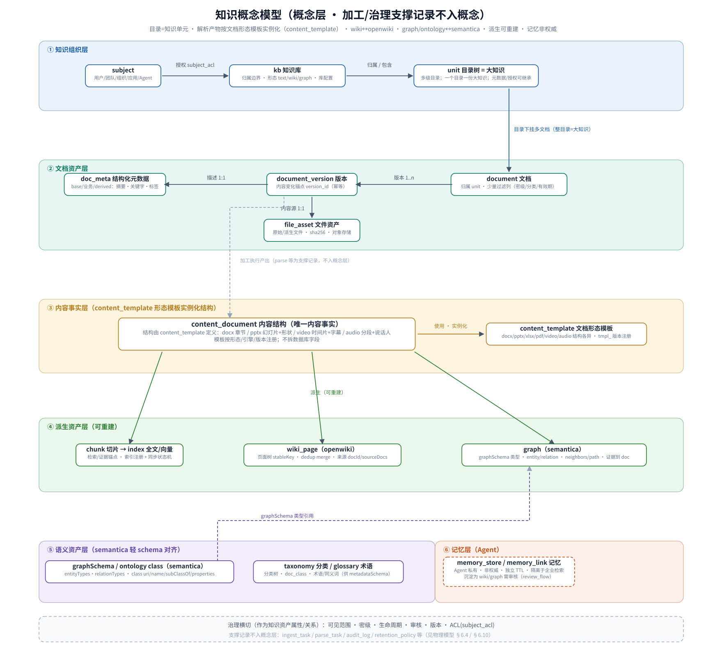
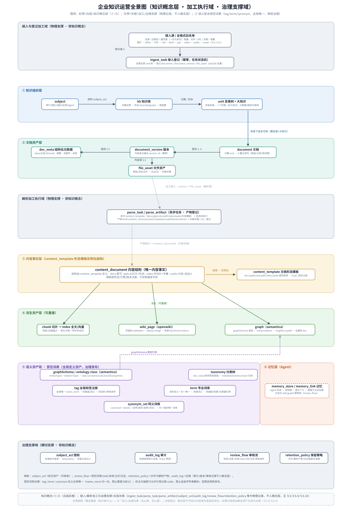
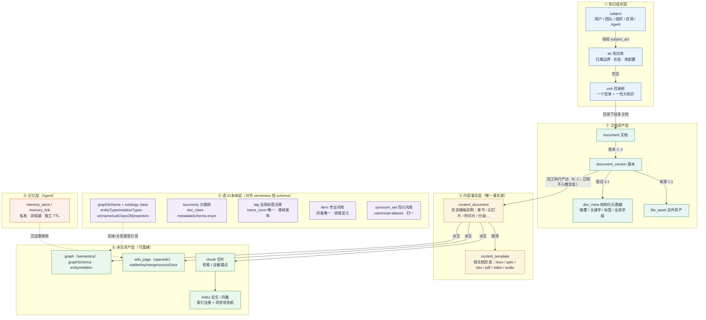

# 企业级知识运营数据模型总体设计方案

> 状态：设计评审稿 · v2（2026-09-05，含评审修订 v2.1/v2.2/v2.3）
> v2 修订：按评审反馈优化——①目录作为「知识单元（大知识）」一等建模；②文档元数据（摘要/关键字/标签/业务元数据等）用**结构化元数据文档**承载；③解析后内容按**文档结构**存储，不拆成数据库字段列。
> v2.1 修订：④任务/治理类对象（`ingest_task/parse_task` 等）仅作物理支撑，**不入知识概念模型**；⑤解析产物按**文档形态使用内容结构模板**（`content_template`：docx 章节 / pptx 幻灯片+形状 / video 时间片 / audio 分段…各不相同），概念图显式体现模板关系；⑥Wiki 概念**严格对齐 openwiki-server**（`wiki+page` 两层，stableKey/dedup/sourceDocs），图谱与本体**严格对齐 semantica-graph-server**（`graphSchema{entityTypes,relationTypes}` + entity/relation，本体编译为 graphSchema/OWL 的定义资产）。
> v2.2 修订：⑦新增**受控词表治理**——全局标签注册 `tag`（`name_norm` 全局唯一，禁止重复/歧义、禁止自由字符串散标）、专业词库 `term`、同义词库 `synonym_set`（归一解析到唯一词条），新增/改名/合并/废弃统一走 `review_flow` 审核发布；⑧v1.0 概念模型图保留为快照（图 1），新增**知识运营全景图**（图 2，概念层 + 接入/解析加工执行域 + 治理支撑域分层表达）。
> v2.3 修订：⑨**基于全景图（图 2）全面校准全文**——§3 总体架构改为全景分层；§6.4 补齐「接入与登记加工域」链路与 `ingest_task`；§6.10 治理支撑域补作用面映射与受控词表治理流；§9/§10/§11 同步接入任务、词表状态机与受控词表开放问题。
> 范围：open-ikc 北向开放平台（`app/services/*_store.py` 业务存储 + 管理面 SQLite + `data/uploads` 暂存文件）的**企业级知识运营数据模型差距分析与目标设计**。
> 权威顺序：本文件是**内部数据模型设计参考**，服从 `AGENTS.md` 与当前代码；不改变对外四类业务能力面、不新增第五类业务域、不改变路由与 `catalog.py`。对外协议变更须另行评审。

## 0. 结论摘要

| 维度 | 结论 |
| --- | --- |
| 全景分层 | 概念层（①-⑥，含受控词表）+ 接入/解析加工执行域 + 治理支撑域已分域表达（图 2） | 概念层不承载任务对象；加工/治理为物理支撑记录（§5 边界 + §6.4/§6.10） | 
| 能力协议 | 四类能力 + `kbMode=text/wiki/graph` 专业库形态的协议与对象模型骨架可用（pytest 282 passed 基线，2026-08-18） |
| 数据持久化 | 业务数据全部在进程内 dict，重启即失；仅管理面 token/统计落 SQLite。**不满足企业级多实例、持久化、可审计与容量要求** |
| 知识组织 | 只有扁平 kb→document，**没有目录/知识单元层次**；「一个目录下是一份大知识」的批量接入、整目录加工与权限边界无模型承载 |
| 文档与元数据 | 文档只有登记字段；**摘要/关键字/标签等派生与业务元数据无结构化承载**；无版本 |
| 解析内容 | 解析产物内存占位（pageList 等）；**内容按字段/数组散放，未按“文档结构”持久化**，无法支撑结构级检索与重建 |
| Wiki/图谱 | 页面树与实体/关系对象模型（openwiki/semantica 引擎同构）可继承；open-ikc 侧缺引擎外的版本/审核/细粒度证据超集与本体定义编译 |
| 语义资产 | 无本体/分类/术语；**无全局标签/专业词库/同义词等受控词表**（标签散标、无法治理）；无 Agent 记忆结构；无治理审计台账 |

**总评**：当前模型是「协议验证 + 单机占位」，距企业级知识运营差一层完整的**知识组织（目录单元）+ 文档资产（版本/元数据）+ 内容结构存储 + 派生索引/语义资产 + 治理横切**。目标模型遵循一条主线：**目录是知识单元，文档是资产，解析内容是结构化文档，索引/wiki/图谱全部是“结构化内容在特定版本上的派生视图”**——数据库只放少量稳定列与引用，不铺复杂字段。

## 1. 现状盘点（代码事实）

### 1.1 运行时业务存储（全部进程内）

| 存储类（`app/services/`） | 记录对象 | 承载摘要 | 问题 |
| --- | --- | --- | --- |
| `knowledge_base_store.py` | `KnowledgeBaseRecord` | kbId/kbName/kbType/kbMode/scope/owner/metadataSchema/wikiConfig/graphSchema | 仅“库”一层容器，无目录层次 |
| `document_store.py` | `DocumentRecord` | docId/kbId/标题/sourceType/sourceUrl/objectKey/tags/metadata/状态 | 无版本、无目录归属、metadata 自由 JSON |
| `upload_store.py` | `UploadRecord` + sidecar | fileId/名称/MIME/大小/7 天 TTL | 白名单缺图片/音视频/邮件 |
| `parse_store.py` | `ParseTaskRecord`/`ParseResultRecord`/`ParseTicketRecord` | 任务/结果/凭证 | 内容占位（pageList/字段），不落库 |
| `search_store.py` | `SearchIndexRecord` | chunkId/content/keywords/page/position | 内存关键词占位 |
| `wiki_store.py` | `WikiPageRecord` | 稳定 pageId/树/links/sourceDocs/markdown | 无版本/审核/内容结构锚点 |
| `graph_store.py` | `GraphNodeRecord`/`GraphRelationRecord` | 稳定 ID/证据/置信度/增量废弃 | 无构建日志/本体注册 |
| 管理面 | SQLite 四表 | token/请求统计 | 独立 DB，仅 `/admin/*` |

### 1.2 现有持久化边界

- 业务库（kb/文档/wiki/图谱/索引/解析）无任何落库；多实例不共享。
- 上传文件暂存 `data/uploads/`（`up_<hex>` + `.json` sidecar），7 天 TTL。
- `data/open_ikc_platform.db`：管理面 `api_tokens/request_stats/endpoint_agg/token_agg`。

### 1.3 文档类型与加工声明现状

- 上传允许扩展名：pdf/doc/docx/xls/xlsx/ppt/pptx/txt/md/csv/html/htm/xml/json/yaml/yml/zip/rar/7z——**不含图片、音视频、邮件**。
- `parseStrategy.docType`：auto/pdf/docx/xlsx/pptx/txt/md/html/jpg/png；`parseMode`：auto/ocr/structure；`chunking` 已预埋 `audioVideoChunkDuration`。
- `DocumentSource.type`：url/file/directory/archive——directory/archive 接入只有扁平登记，**不还原目录结构**。

## 2. 需求满足度与差距矩阵

| ID | 企业级需求 | 现状支撑 | 主要差距 | 阶段 |
| --- | --- | --- | --- | --- |
| R1 | 目录结构即知识组织；**一个目录是一份大知识**，目录下多文档/多子目录 | kb→document 扁平 | 无 knowledge_unit 树；目录 ingest 不建结构、无整目录加工/检索/权限 | M1 |
| R2 | 全格式接入（图片/excel/pdf/word/md/html/ppt/video/audio/邮件） | 部分扩展名 | 无图片/音视频/邮件白名单；无资产登记与文件签名识别 | M1 |
| R3 | 文档版本与内容更新 | 重复登记冲突 | 无 document_version，产物不可回滚/增量 | M1 |
| R4 | 文档元数据：基础 + 业务 + 派生（摘要/关键字/标签/分类…） | 自由 metadata JSON | 无结构化元数据文档与校验/过滤约定 | M1 |
| R5 | 解析内容按**文档结构**存储（页面/标题/段落/表格/图/音视频块） | pageList 内存占位 | 无结构化内容模型与版本化存储 | M1 |
| R6 | 全文 + 向量索引（可重建、可增量） | 内存 chunk + 环境映射 | 无索引注册与 doc→index 状态机 | M1 |
| R7 | Wiki 编译知识库 | 页面树/合并/引擎 | 缺版本/审核/内容结构锚点/页面权限 | M2 |
| R8 | 图谱与图查询 | 实体/关系/证据齐全 | 缺构建日志、本体注册、类型治理 | M2/M3 |
| R9 | 本体/分类法/受控词表治理（全局标签/专业词库/同义词） | metadata enum 单库字符串；标签自由散标 | 无 ontology/taxonomy/glossary/tag/term/synonym 全局注册与审核发布 | M3 |
| R10 | Agent 记忆 | 无 | 无结构/隔离/保留/沉淀 | M3 |
| R11 | 治理与合规（版本/审核/密级/审计/保留） | 仅请求统计 | 业务侧缺失 | M2 |
| R12 | 数据层权限（目录/文档级 ACL、检索过滤） | kbType 收敛 + 循环校验 | 无 ACL 表与检索过滤列 | M2 |
| R13 | 持久化与容量 | 进程内 dict | 需主库 + 对象存储 + 派生索引 | M0 |

## 3. 目标总体数据架构

总体按全景图（图 2）分为三层表达：**知识概念层**（模型语义，①②③④⑤⑥）、**加工执行域**（接入/解析，物理支撑）、**治理支撑域**（横切，物理支撑）。

```text
┌ 接入与登记加工域（物理支撑，非知识概念；图 2 上半部）─────┐
│  接入源：目录/压缩包（整目录=大知识）/URL/文件/对象          │
│  └ ingest_task（幂等 req_id）：还原 unit 树；               │
│     登记 document / document_version / file_asset（sha256） │
└─────────────────────────────────────────────────────────────┘
┌─ ① 知识组织层（目录即知识单元）───────────────────────────┐
│  knowledge_base（归属/形态/可见范围/wikiConfig/graphSchema）│
│    └ knowledge_unit 目录树（一个目录=一份大知识）           │
│        └ document（挂 unit，可多版本）                      │
└─────────────────────────────────────────────────────────────┘
┌─ ② 文档资产层（少列 + 引用）──────────────────────────────┐
│  document_version / file_asset / doc_meta(结构化元数据)     │
└─────────────────────────────────────────────────────────────┘
┌ 解析加工执行域（物理支撑，非知识概念；图 2 中部）──────────┐
│  parse_task（命中 content_template 形态模板，状态机）       │
│  └ parse_artifact（content_structure/text/字幕/缩略图→对象存储）│
└─────────────────────────────────────────────────────────────┘
┌─ ③ 内容事实层（解析内容 = 结构化文档，不拆字段）───────────┐
│  content_template（形态产物模板）→ content_document（实例）  │
└─────────────────────────────────────────────────────────────┘
┌─ ④ 派生资产层（由“内容结构 × 版本”重建）──────────────────┐
│  chunk / index（全文/向量，doc_index_state 驱动）           │
│  wiki_page（openwiki）/ graph（semantica entity/relation）   │
└─────────────────────────────────────────────────────────────┘
┌─ ⑤ 语义资产层 · 受控词表（全局定义资产，治理发布）─────────┐
│  graphSchema + ontology class（semantica）                  │
│  taxonomy / tag（全局标签）/ term（专业词库）/ synonym_set   │
└─────────────────────────────────────────────────────────────┘
┌─ ⑥ 记忆层（独立生命周期，非权威）与 ──────────────────────┐
│  治理支撑域（图 2 底部）：subject_acl/audit_log/            │
│  review_flow/retention_policy + 受控词表治理（审核发布）     │
└─────────────────────────────────────────────────────────────┘
```

主数据流：`接入源 → ingest_task（还原 unit 树、登记 document/version/file_asset）→ parse_task（命中 content_template）→ parse_artifact → content_document（结构化）→ 派生 chunk/wiki/graph/全文/向量`；任何派生资产都可以从「目录子树内文档版本的 content_document」重建。元数据层只存稳定标识、归属、引用、统计与少量过滤列，**内容与业务元数据一律以结构化文档承载**。

**全景分域 → 章节/表 映射**（阅读索引）：

| 图 2 分区 | 角色 | 物理落点 | 是否知识概念 |
| --- | --- | --- | --- |
| 接入与登记加工域 | 输入/登记（目录还原、幂等） | §6.4 `ingest_task`；产出见 §6.1 `knowledge_unit`/§6.2 `document` 等 | 否（支撑） |
| 解析加工执行域 | 解析/产物 | §6.4 `parse_task`/`parse_artifact` | 否（支撑） |
| ① 知识组织 / ② 文档资产 | 知识资产底座 | §6.1/§6.2 | 是 |
| ③ 内容事实层 | 唯一内容事实 | §6.3 `content_template`/`content_document` | 是 |
| ④ 派生资产层 | 可重建视图 | §6.4-6.7 chunk/index/wiki/graph | 是 |
| ⑤ 语义资产层·受控词表 | 全局定义/标注/归一 | §6.8 ontology/taxonomy/tag/term/synonym_set | 是 |
| ⑥ 记忆层 | Agent 私有记忆 | §6.9 | 是 |
| 治理支撑域 | 授权/审计/审核/保留 + 词表治理 | §6.10；任务对象见 §6.4 | 否（支撑） |

## 4. 设计原则

1. **目录是知识单元**：知识库内允许多级目录（knowledge_unit），一个目录在语义上是一份“大知识”，可整体声明元数据、批量接入、整目录编译/检索/授权/归档。
2. **列少而稳（列最小化）**：业务表只保留标识、归属、引用、状态、时间、少量高频过滤列；**摘要/关键字/标签/自定义字段等一律进结构化元数据文档**，避免表随需求膨胀。
3. **内容按结构存储（content-native）且按形态模板化**：解析结果不是“打散的字段”，而是带类型的**文档结构**；结构由**文档形态产物模板**定义——Word 与 PPT、PDF 与 Excel、Video 与 Audio 的结构单元各不相同（docx 用章节/段落/表格，pptx 用幻灯片/形状/备注，video 用场景/时间片/字幕/转写，audio 用分段/说话人）。主库存引用与统计，结构体进对象存储/文档库。
4. **派生可重建**：chunk、全文/向量索引、wiki 页面、图谱都是「content_document × doc_version」的派生视图，有状态机、可重建，禁止只改派生不同步。
5. **来源可溯**：派生资产保留来源定位（doc_id、version_id、block_id/page/时间片、引擎、置信度）。
6. **版本与审核分离**：机器编译/抽取默认 draft，发布（published）前可审核；文档更新产生新版本，旧版本资产可追踪回滚。
7. **权限不降级落到数据层**：ACL（目录可继承）+ 密级/org_path 过滤列进查询与索引；owner_id 取认证身份，data_owner_id 表资源归属。
8. **稳定 ID 延续 sha1 派生**；删除状态软删；兼容演进，M0-M3 不动对外契约。
9. **受控词表全局治理**：标签/专业词条/同义词定义全局唯一（`name_norm` 归一化，禁止重复与歧义），标注与抽取只允许引用注册 code，禁止自由字符串散标；词条新增/改名/合并/废弃经 `review_flow` 审核发布，废弃仅停用不删除（历史引用快照保留）。

## 5. 概念模型

> 本节定义**知识领域概念及其关系**（谁拥有谁、谁派生谁、谁能引用谁），是 §6 物理表设计的语义依据。
> **边界声明：加工/执行类对象（`ingest_task`、`parse_task` 等）是过程支撑记录，不属于知识概念，不进入概念模型**；它们只出现在物理加工域（§6.4）用于驱动「内容事实」的生成与派生的执行。

### 5.1 概念总览

概念按职责分为六组（治理与权限作为知识资产的**横切属性/关系**承载，不单独成概念）：

| 概念组 | 概念 | 一句话定义 |
| --- | --- | --- |
| 知识组织 | `subject`（用户/团队/组织/应用/Agent）、`kb`（知识库）、`unit`（知识单元=目录） | kb 是归属与形态边界；unit 树把“一个目录=一份大知识”落到可管理实体 |
| 文档资产 | `document`、`document_version`、`file_asset`、`doc_meta`（结构化元数据） | 文档是资产，版本是内容变化锚点，元数据以结构文档承载（摘要/关键字/标签/业务字段） |
| 内容事实 | `content_template`（按文档形态的产物结构模板）、`content_document`（结构化文档=模板实例化出的 block 树） | 解析产出的唯一内容事实，按版本存储；结构由形态模板决定（docx/pptx/xlsx/pdf/video/audio 各异），不拆字段 |
| 派生资产 | `chunk`、`index`（全文/向量）、`wiki_page`（对齐 openwiki）、`graph`（对齐 semantica） | 全部可由「content_document × version」重建；wiki=页面树（stableKey/merge/sourceDocs），graph=graphSchema 实体/关系（neighbors/path） |
| 语义资产 | `graphSchema` + `ontology class`（对齐 semantica）、`taxonomy`（分类树）、`tag`（全局标签注册）、`term`（专业词库）、`synonym_set`（同义词库） | 本体的引擎形态即 `{entityTypes[],relationTypes[]}`；class 定义编译为 graphSchema/OWL；受控词表为**全局定义资产**（name_norm 唯一、审核发布），供标注、metadataSchema enum、抽取与检索归一 |
| 记忆 | `memory_store`、`memory_link` | Agent 私有记忆，独立生命周期，默认非权威 |

> 治理横切关注点（可见范围、密级、生命周期状态、审核状态、版本、ACL 授权、审计、保留策略）作为**知识资产属性或资产间关系**建模（见 §6.1-§6.10 物理落点），不进入概念层实体；`ingest_task/parse_task` 更不属于知识概念，见上文边界声明。

> **引擎对齐基线**：wiki 概念严格贴合 `openwiki-server`——只有 `wiki`（kb 级实例）+ `page` 两层（stableKey/merge/sourceDocs，无 space/版本/block 原生语义）；graph 与 ontology 严格贴合 `semantica-graph-server`——图是 `graphSchema{entityTypes[],relationTypes[]}` 约束下的 entity/relation（稳定 ID、evidence、软废弃、neighbors/path），本体即 schema + 上游 class 定义。open-ikc 侧的版本快照/审核/细粒度证据等均为超集，不得改变引擎语义。

### 5.2 概念模型图

> 若阅读器不支持 Mermaid，可直接查看下方 SVG（浏览器/支持 SVG 的 Markdown 预览均可打开）：图 1 为知识概念模型 v1.0 快照；图 2 为含加工执行域与治理支撑域的全景图。

<p align="center">
  
  <br/>
  <em>图 1（v1.0 快照，保留不覆盖）：知识概念模型 —— 六组知识概念 + 加工/治理边界（目录=知识单元；content_template 按文档形态实例化；wiki↔openwiki、graph/ontology↔semantica 对齐；内容事实单一；派生可重建）。v2.2 起的受控词表扩展（tag/term/synonym）与加工/治理支撑的完整表达见图 2</em>
</p>

<p align="center">
  
  <br/>
  <em>图 2（全景图 v1.0）：概念层（图 1 六组）与加工执行域、治理支撑域分域表达——接入源 → ingest（登记 unit/document/file_asset）→ parse（命中 content_template）→ content_document → 派生资产；受控词表（tag/term/synonym）与授权/审计/审核/保留为治理支撑，物理记录不入概念层</em>
</p>

同一模型的分层 Mermaid 流程图源码（编辑维护用；按层自上而下布局，避免 ER 式交叉连线）：



> 图例：实线=相邻层的归属/派生关系；虚线=语义/记忆层的引用与审核沉淀（跨层）；基数与完整关系见 §5.3；`doc_index_state`/`chunk_embedding_meta`/`subject_acl`/`memory_link` 等为物理支撑关系，不在此概念图中铺线，避免交叉成“蜘蛛网”。

### 5.3 关键关系语义（基数与约束）

| 关系 | 基数 | 语义与约束 |
| --- | --- | --- |
| `kb` → `knowledge_unit` | 1—N | 每个 kb 恒有根目录（`unit_path=/`），其下可建多级目录；kb 删除=库整体软删，unit 树一并标记 retired |
| `knowledge_unit` → `knowledge_unit`（自引用） | 1—N | `parent_unit_id` 构成树；`unit_path` 库内唯一；同一 unit 不得同时存在相同 `unit_name` 子目录；子树是「大知识」的聚合边界 |
| `knowledge_unit` → `document` | 1—N | 文档必须归属某 unit（M1 起强制，存量文档归根目录）；目录整树迁移/归档时子文档跟随 |
| `document` → `document_version` | 1—N | 同源重复/内容变化 ingest 产生新版本；`content_hash` 未变时不产新版本（幂等） |
| `document_version` → `file_asset` | 1—1 | 版本内容源（原始文件）；派生文件（转码/缩略图）通过 `file_asset.variant_of` 链到原始资产 |
| `document_version` → `doc_meta` | 1—1 | 每版本一份结构化元数据（base/business/derived 三段），schemaVersion 演进，不拆列 |
| `document_version` → `content_document` | 1—0..1 | 每个文档版本至多持有一份有效内容结构（未解析/解析失败则无）；产出动作由加工过程完成（过程记录见 §6.4，非知识概念） |
| `content_document` → `content_template` | N—1 | content_document 是形态模板的**实例化**：模板按 `(format_family × 引擎 × template_version)` 注册，定义结构单元/块类型/定位键与派生映射；文档版本解析时锁定所用模板版本 |
| `content_document` → `chunk` | 1—N | chunk 是内容结构的“切片+定位”派生视图（块引用）；结构变化=旧 chunk 标记 deprecated |
| `document_version`/`index_registry` → `doc_index_state` | 1—N / 1—N | 每「版本×索引」一条同步状态，驱动增量/重试/重建 |
| `chunk`/`index_registry` → `chunk_embedding_meta` | 1—N / 1—N | 向量为派生；embedding 元数据本地登记，向量体可外置 |
| `content_document` → `wiki_page` | N—N | 页面由文档编译产生（对齐 openwiki：`docId + sourceDocs` 粒度）；open-ikc 可选超集 `based_on_version_id/source_blocks` 支持块级回源 |
| `kb` → `graph` | 1—N | 库级图谱（默认）与目录级子图谱（可选）；配置变更按 `schema_version` diff |
| `ontology_concept` → `graph_entity` | 1—N | `entity_type` 演进为引用 `canonical_concept_id`；实体类型治理不依赖库内字符串 |
| `tag` → `doc_meta`/`knowledge_unit`/`wiki_page` | N—N | 标注只允许引用全局 `tag` 注册 code（name_norm 全局唯一），meta/fields 存 tag_id+name 快照；标签新增/改名/废弃走审核发布 |
| `term`/`synonym_set` → 抽取实体/`doc_meta.entities` | N—N | 抽取候选须归一解析到唯一 `term`/`synonym_set` canonical，避免一义多表与歧义 |
| `memory_store` → `document/wiki_page/graph_entity` | N—N | 记忆可关联任意资源（memory_link），但记忆不进入企业权威检索 |
| `subject` → `kb/unit/document/wiki_page/graph/ontology/memory` | N—N | 经 `subject_acl` 授权（allow/deny），unit 授权可被子目录继承；与 AUTHZ deny-overrides 一致 |

### 5.4 聚合根与一致性边界

| 聚合根 | 内部一致性规则 | 派生/重建入口 |
| --- | --- | --- |
| `knowledge_base` | 库配置（wikiConfig/graphSchema/metadataSchema）版本化，变更触发资产 diff | — |
| `knowledge_unit` | 树路径唯一、子树文档可见性/密级可继承可覆盖 | 整目录批量接入、整目录检索、整目录编译（Wiki 章节/图谱子图） |
| `document` | 版本只增不改；当前版本 `is_current=true` 唯一 | 新版本=新一轮内容加工基线 |
| `content_document` | 每版本一份有效结构；block 引用稳定 | chunk/索引/wiki/图谱的重建事实源 |
| `wiki_page` | 页面稳定键 `(kbId, stableKey)` 唯一（引擎同源）；合并按 `dedup`、废弃随 doc | 由 openwiki build/merge/deprecate 驱动；快照/审核为 open-ikc 超集 |
| `graph` | 实体对齐键 `(graphId, type, normalizedName)` 唯一；关系证据可回溯到块 | 由内容结构重建，增量按源文档版本废弃 |
| `ontology_concept` | 本体概念跨库复用；变更走审核后发布 | 供 graphSchema/metadataSchema 引用 |
| `memory_store` | Agent 私有、TTL 独立 | 沉淀企业知识需审核（review_flow） |

### 5.5 生命周期与派生方向（阅读指引）

```text
组织：subject --授权--> kb --> unit(树) --> document --> version
事实：version --(加工执行，过程不入概念层)--> content_document(结构/块)
模板：content_template(按文档形态/引擎版本注册) --定义结构--> content_document（docx 章节/表格、pptx 幻灯片+形状、video 时间片+字幕、audio 分段+说话人…）
派生：content_document --> chunk --> 全文/向量索引
      content_document --> wiki_page(版本/审核) 、 graph(entity/relation)
语义：ontology(concept/property/relation_def) + taxonomy(分类) + tag(全局标签) + term(专业词库) + synonym_set(同义词库) --引用--> graph/wiki/metadata/标注（受控词表全局唯一、审核发布）
记忆：memory_store --审核--> 沉淀为 wiki/graph；默认隔离于企业权威知识
治理：可见范围/密级/生命周期/审核/版本（资产属性） + ACL 授权关系（subject_acl）横切；
      审计与保留为支撑记录（§6.10），同样不进入知识概念
```

派生方向是单向的：**任何改动都不得绕过 content_document 直接修改 chunk/索引/wiki/graph**；元数据、内容、派生三层的版本锚点（`version_id`）保持一致。

## 6. 目标数据模型（少列、结构化、可扩展）

> 表按 snake_case；时间统一 epoch ms；业务表公共列：`created_at/updated_at/tenant_id/org_id/org_path/owner_id/data_owner_id/status/row_version`；删除软删。
> **表分两类**：①知识资产表（§6.1-6.3、6.6-6.9）对应 §5 概念模型；②加工与治理支撑表（§6.4、6.5、6.10，含 `parse_task/parse_artifact/parse_chunk/index 状态/subject_acl/audit_log/review_flow/retention_policy`）为实现服务物理支撑，不属于知识概念（§5 边界声明）。

### 6.1 知识组织层：目录 = 知识单元

**表 `kb`（KnowledgeBaseRecord 演进，列不增）**
- `kb_id` PK、`kb_name`、`kb_desc`、`kb_type`（personal/team/enterprise）、`kb_mode`（text/wiki/graph）
- `team_id`、`org_id`、`org_path`、`scope_key`、`visibility`、`biz_domain`、`confidential_level`
- `metadata_schema_json`、`wiki_config_json`、`graph_schema_json`
- `default_ontology_id`/`default_taxonomy_id`（语义引用，可空）、`schema_version`、`status`
- 唯一 `(scope_key, kb_name, status<>deleted)`

**表 `knowledge_unit`（新增：目录/知识单元树）**
- `unit_id` PK（unit_ 前缀）、`kb_id`、`parent_unit_id`（可空=根）、`unit_name`、`unit_path`（`/知识库/产品中心/…`，唯一）
- `level`、`order_no`、`is_leaf`（无子目录快查）、`unit_type`：folder/bundle（压缩包映射）
- 继承与覆盖：`visibility`、`confidential_level`、`owner_id`/`data_owner_id`（子级可覆盖）
- `meta_ref`（结构化元数据文档：目录级摘要/关键字/标签，见 6.3）
- 聚合统计物化：`doc_count`、`ingest_status`（子树接入进度）、`last_ingest_at`
- `status`：active/archived/retired
- 唯一 `(kb_id, unit_path)`；索引 `(parent_unit_id)`、`(kb_id, org_path)`
- 语义：ingest 一个 directory/archive 时按源结构自动建 unit 树与 document；**一个目录可被当作一份大知识**做整目录解析、Wiki 章节编译、图谱子图、整目录检索与 ACL 授权。

### 6.2 文档资产层

**表 `document`（DocumentRecord 演进；只保留稳定列）**
- `doc_id` PK、`kb_id`、`unit_id`（目录归属，一级公民）
- `doc_title`、`title_norm`、`doc_no`（业务编号，可空）
- `source_type`：url/file/directory/archive/object；`source_url`、`source_key`（幂等源键）
- `format_family`：pdf/word/excel/ppt/md/html/txt/csv/image/video/audio/email/archive/other（签名识别）
- `mime_type`、`language`、`size_bytes`
- `current_version_id`、`ingest_task_id`、`last_parse_task_id`
- 少量高频过滤列：`confidential_level`、`doc_class`（来自分类法，冗余）、`effective_from`、`effective_to`
- `lifecycle_status`：draft/active/archived/expired/retired
- 唯一 `(kb_id, unit_id, source_key, lifecycle_status<>retired)`；索引 `(unit_id)`、`(format_family)`、`(confidential_level)`

**表 `document_version`（版本锚点）**
- `version_id` PK（ver_ 前缀）、`doc_id`、`version_no`、`asset_id`、`content_hash`（sha256）
- `size_bytes`、`page_count_hint`、`change_summary`、`operator_id`、`is_current`
- 唯一 `(doc_id, version_no)`；索引 `(content_hash)`

**表 `file_asset`（对象登记）**
- `asset_id` PK（asset_ 前缀）、`storage_backend`、`bucket`、`object_key`
- `file_name`、`extension`、`mime_type`、`format_family`、`size_bytes`、`sha256`
- 多模态列：`media_duration_ms`、`width`、`height`、`codec`、`language`
- `variant_of`（缩略图/转码/字幕等派生文件）、`status`、`expires_at`
- 索引 `(sha256)`、`(tenant_id, status)`

### 6.3 结构化元数据与内容模型（核心简化：不铺列）

**设计要点**：文档/目录的元数据与解析内容都以**结构化文档**承载，数据库不按“字段”拆表拆列。

**元数据文档 `doc_meta`（或 `meta_ref` 指向同一结构）**

元数据统一为一个版本化的 JSON 结构文档（入库为单列 JSON / 对象存储引用均可），按来源分节，schema 版本化：

```json
{
  "schemaVersion": 1,
  "source": "auto | manual | engine:xxx@v1.2",
  "base":   { "title": "", "author": "", "language": "zh", "confidentialLevel": "C2" },
  "business": { "docType": "合同", "product": "xxx" },
  "derived": {
    "summary": "一段自动摘要",
    "keywords": ["大模型", "知识运营"],
    "tags": [{"tagId": "tag_制度", "name": "制度"}, {"tagId": "tag_产品手册", "name": "产品手册"}],
    "entities": [{"name": "xx", "type": "product", "conceptId": "con_..."}]
  }
}
```

- `base`：标题/作者/语言/密级等系统与通用字段；
- `business`：来自 `metadataSchema` 的业务元数据值；
- `derived`：解析/AI 产生的摘要、关键字、标签、实体、分类、问题等；**标签只允许引用全局 `tag` 注册表 code**（存 tagId+name 快照，name 仅展示），禁止自由字符串散标。
- 需要“过滤/排序/权限”的字段（密级、分类、生效期等少数几个）**冗余为 document 上的少量列**；其余一律留在元数据文档里，按 `schemaVersion` 演进，不新增表列。
- 目录级 `knowledge_unit.meta_ref` 同构（目录摘要/标签等），支持向子目录/文档继承。

**形态产物模板 `content_template`（不同文档形态使用不同产物结构）**

解析产物不是一种通用的“块列表”，而是**按文档形态选择模板、再由模板定义类型化结构**。模板注册表（`tmpl_` 前缀）按 `format_family × 解析引擎 × 版本` 登记：

| 形态 | 模板示例 | 一级结构单元 | 特有内容/块 |
| --- | --- | --- | --- |
| Word | `doc:word@v1` | sections（章节树） | heading/paragraph/table/图片/页眉页脚/批注/页码 |
| PPT | `doc:ppt@v1` | slides（幻灯片流） | slideNo/layout/shape（text/image/table/chart）/speakerNotes/嵌入媒体 |
| PDF | `doc:pdf@v1` | pages（页面流） | 版面块（bbox）：heading/paragraph/table/ocr_region/figure/formula |
| Excel | `doc:xlsx@v1` | sheets（工作表） | 行列/合并单元格/公式结果/图表/批注 |
| Video | `media:video@v1` | tracks→scenes/shots（时间轴） | timelineClips/keyframes/subtitles/transcript/audioTrack |
| Audio | `media:audio@v1` | segments（音频分段） | speakerDiarization/transcript/语言/时间戳 |
| Image | `media:image@v1` | regions（版面/目标区） | ocrRegions/bbox/标签/caption |
| MD/HTML | `doc:web@v1` | 标题树 + 正文流 | heading/paragraph/links/code/table/图/引用 |
| Email | `doc:email@v1` | header + body | From/To/Subject/时间 + html/text 正文 + 附件引用 |

每个模板定义四件事：①允许的结构单元与层级（schema）；②定位键（Word/PDF=页码+块，PPT=slideNo+shape，video/audio=时间片+segNo，Excel=sheet+行列坐标）；③必填字段与校验；④下游映射建议（chunk 切分规则、wiki 页面结构、图谱抽取输入）。

**表 `content_template`（模板注册，结构定义资产）**
- `template_id` PK（tmpl_ 前缀）、`name`、`applies_format_family`（word/ppt/xlsx/pdf/video/audio/image/web…）、`applies_doc_type`（docx/pptx/xlsx/mp4/mp3…，可空=整个形态族）
- `engine`、`engine_version`、`template_version`、`structure_schema_json`（结构单元/块类型/必填/定位键）、`mapping_json`（chunk/wiki/graph 派生映射）、`renderer`
- `status`：draft/active/retired；唯一 `(applies_format_family, applies_doc_type, engine, template_version)`

**内容结构文档 `content_document`（模板实例化后的“文档结构”）**

`content_document` 是「版本 × 模板」的实例：公共 envelope 携带 `template_id/template_version`，`structure` 由模板定义；表现层导出（text/markdown/json）由模板的渲染器生成（`resultFormat` 保留语义）。

Word 模板实例（章节/段落/表格，页面定位）：

```json
{
  "templateId": "tmpl_doc_word_v1", "templateVersion": 1,
  "versionId": "ver_...", "docId": "doc_...", "pageCount": 12,
  "structure": {
    "sections": [
      {"headingPath": "第一章/1.1 概述", "blocks": [
        {"blockId": "b_001", "type": "paragraph", "page": 1, "text": "…"},
        {"blockId": "b_002", "type": "table", "page": 3, "rows": [["列1","列2"],["v1","v2"]]}
      ]}
    ]
  }
}
```

PPT 模板实例（幻灯片/形状/备注，slideNo 定位）：

```json
{
  "templateId": "tmpl_doc_ppt_v1", "templateVersion": 1,
  "versionId": "ver_...", "docId": "doc_...", "slideCount": 20,
  "structure": {
    "slides": [
      {"slideNo": 1, "layout": "title", "shapes": [
        {"blockId": "s_001", "type": "text", "text": "产品发布"},
        {"blockId": "s_002", "type": "image", "assetRef": "asset_...", "caption": "架构图"}
      ], "speakerNotes": {"blockId": "s_009", "text": "…"}}
    ]
  }
}
```

Video 模板实例（时间轴场景/字幕/转写，时间片定位）：

```json
{
  "templateId": "tmpl_media_video_v1", "templateVersion": 1,
  "versionId": "ver_...", "docId": "doc_...", "durationMs": 900000,
  "structure": {
    "scenes": [
      {"sceneNo": 1, "startMs": 0, "endMs": 42000,
       "clips": [
         {"blockId": "c_001", "type": "video_clip", "assetRef": "asset_...", "startMs": 0, "endMs": 42000,
          "subtitleRef": "asset_...", "transcript": "…", "speakers": ["speaker_A"]}
       ]}
    ]
  }
}
```

Audio 模板实例（分段/说话人/转写，segNo+时间戳定位）：

```json
{
  "templateId": "tmpl_media_audio_v1", "templateVersion": 1,
  "versionId": "ver_...", "docId": "doc_...", "durationMs": 360000,
  "structure": {
    "segments": [
      {"segNo": 1, "startMs": 0, "endMs": 8000,
       "blockId": "a_001", "speaker": "speaker_A", "transcript": "…", "language": "zh"}
    ]
  }
}
```

- 模板决定**结构单元**（page/section/slide/scene/segment/sheet…）、**允许的块类型**与定位键；不要求各形态结构同构，只要求可导出统一的 blockId 锚点；
- 块/结构单元是切片与**引用定位**的统一锚点：全文/向量索引的 chunk、Wiki 页面引用、图谱实体/关系证据都引用 `blockId + page/slideNo/时间片/segNo`；
- 模板按 `template_version` 演进；`content_document` 指向解析时使用的模板版本，引擎升级可保留旧结构兼容回放；无匹配形态时回退通用模板（generic）；
- 存储：`content_template` 表存模板定义（schema/mapping JSON）；`parse_artifact` 登记 `kind=content_structure` 产物；`content_document` 表只存 `(version_id, template_id/version, content_ref, block_count, page_count, char_count, 校验和)` 统计行，**内容体不拆字段**。

### 6.4 加工执行域（接入/解析，物理支撑）与派生切片

> 对应图 2「接入与登记加工域」+「解析加工执行域」：接入源 → `ingest_task`（登记 unit/document/version/file_asset）→ `parse_task`（命中 `content_template`）→ `parse_artifact`（产物对象存储登记）→ `content_document`。**本小节全部为物理支撑表，不属于知识概念**（§5 边界声明）；知识资产侧只观察它们驱动生成的结果与状态。

**接入与登记链路（图 2 上半部）**
- 接入源：目录 / 压缩包（整目录=一份大知识，自动还原 unit 树）/ URL / 文件 / 对象存储引用；白名单按 `format_family`（图片/office/PDF/md/html/ppt/video/audio/email…）+ 文件签名识别放行，超长文件与媒体进对象存储。
- 登记物化：`ingest_task` 幂等执行（按 `req_id`），产出 `knowledge_unit` 树与 `document`/`document_version`/`file_asset` 登记；`content_hash` 未变不产生新版本。
- 转解析：对成功登记的版本触发 `parse_task`（可异步），任务记录 `template_id/template_version` 作为回放锚点。

**表 `ingest_task`（接入登记任务，ing_ 前缀，新增）**
- `task_id` PK、`req_id`（幂等键，唯一）、`kb_id`、`unit_id`（目标/新根目录，可空）、`source_type`（directory/archive/url/file/object）、`source_root`/`source_url`、`mode`（create/incremental/resync）
- `strategy_json`（白名单/过滤/去重/子目录规则）、统计（`doc_count`/`unit_created`/`file_count`/`failed_count`）、`status`（queued/running/success/partial/failed）、`error_code`/`error_msg`、`started_at/finished_at`
- 唯一 `(req_id)`；索引 `(kb_id, status)`、`(source_root)`

**表 `parse_task`（ParseTaskRecord 演进）**
- `task_id` PK、`req_id`（幂等）、`doc_id`、`version_id`、`unit_id`、`kb_id`
- `product_type`：parse/text/wiki/graph、`doc_type`/`parse_method`/`parse_mode`/`backend`
- `template_id`/`template_version`（解析时命中的产物模板，回放锚点）
- `strategy_json`、`result_format_json`、`status`（queued/running/success/failed/partial）、`engine_task_id`
- `error_code`/`error_msg`/`progress`；`page_count`/`block_count`/`media_count` 统计
- 唯一 `(req_id)`；索引 `(doc_id, created_at desc)`、`(unit_id)`

**表 `parse_artifact`（产物登记，内容体在对象存储）**
- `artifact_id` PK（art_ 前缀）、`task_id`、`doc_id`、`version_id`
- `kind`：content_structure/text/markdown/json/pages/subtitle/thumbnail…
- `asset_id`/`object_key`、`format`、`encoding`、`size_bytes`、`sha256`、`status`

**表 `content_chunk`（派生切片视图，可重建）**
- `chunk_id` PK（chunk_ + sha1(version_id:blockId/seq)）
- `doc_id`、`version_id`、`unit_id`、`kb_id`、`block_id`（锚点）
- `seq`、`parent_chunk_id`、`chunk_type`（继承 block 类型）、`heading_path`
- `text`、`token_count`；`location_json`（page/bbox/时间片/blockId）
- 权限快照列：`owner_id`/`data_owner_id`/`org_path`/`confidential_level`
- `status`：active/deprecated；索引 `(doc_id, version_id)`、`(unit_id)`
- **定位**：chunk 不是“把内容拆进数据库”，而是对 content_document 的切片+定位视图；**切分单元与规则由 `content_template.mapping` 决定**（如 PPT 按 slide+shape、video/audio 按时长分段、PDF/Word 按页面/章节）；搜索引擎/向量库的写入、引用证据、Wiki 页面引用全部用它。

**表 `media_element`（可选：多模态要素索引）**
- `element_id`、`doc_id`/`version_id`/`chunk_id`、`kind`、`asset_id`、`time_range`/`page`、`caption`/`transcript`、`confidence`
- 内容主存储仍是 block（image/audio_clip/video_clip），本表仅做“可检索媒体要素”的轻量索引。

### 6.5 索引注册与状态

**表 `index_registry`**
- `index_id` PK（idx_ 前缀）、`kb_id`（可空=全局）、`index_type`：fulltext/vector/hybrid
- `backend`：in_process/es/opensearch/ur/openai/pgvector、`backend_ref`、`embedding_model`、`embedding_dim`、`config_json`、`status`

**表 `doc_index_state`**
- `doc_id`、`version_id`、`index_id`、`state`：pending/building/synced/partial/failed/stale
- `chunk_count`、`synced_seq`、`attempts`、`last_error`、`last_synced_at`、`next_retry_at`
- 唯一 `(doc_id, version_id, index_id)`

**表 `chunk_embedding_meta`**
- `chunk_id`、`index_id`、`embedding_model`、`dim`、`vector_ref`（或 pgvector 直存 embedding）、`token_count`、`state`
- 唯一 `(chunk_id, index_id, embedding_model)`

### 6.6 Wiki 域（严格对齐 openwiki-server）

> 引擎事实：openwiki-server 只有 `wiki`（kb 级实例）+ `page` 两层；**无 space/folder/order、无版本快照、无 block、无手工排序**。page 由 `parentPageId+level` 表达树；正文整段 markdown；元数据为 YAML front matter → `fields{}`；links 仅 `{title,pageId}`；生命周期仅 `status=active|deprecated`；去重由 `wikiConfig.dedup`（merge/overwrite/skip）驱动。

**表 `wiki_page`（与 openwiki `WikiPageRecord` 同构，字段 1:1）**
- 引擎同构：`page_id`（wiki_ + sha1(kbId:stableKey)）、`wiki_id`、`kb_id`、`doc_id`（主来源）、`title`、`level`、`parent_page_id`、`stable_key`、`fields_json`（扩展字段）、`tags[]`、`markdown`、`links[]`（`{title,pageId}`）、`source_docs[]`、`status`（active/deprecated）、`created_at/updated_at`
- open-ikc 超集（可空、不参与引擎合并语义）：`unit_id`（目录锚点）、`revision_no`、`content_state`（draft/reviewing/published，本地审核用）、`based_on_version_id`
- 约束：`stableKey=normalize_title(title)` 与 `dedup` 合并语义必须与 openwiki 同源；不引入 `order_no/slug/block 证据` 作为引擎语义（如需要为本地扩展）
- 注：引擎 `tags[]` 为 front matter 原样标签（与 openwiki 同源）；open-ikc 的**受控标注**经 `fields_json` 存全局 `tag` 注册表 code+name 快照，两者可并存，检索/审计以注册表为准。

**表 `wiki_page_version`（open-ikc 快照，非引擎原生）**
- `version_id` PK（pver_）、`page_id`、`stable_key`、`markdown`、`fields_json`、`tags`、`links_json`
- `doc_id` + `source_docs`（快照当时来源）、`mode`（rule/openwiki）、`dedup_action`（merge/overwrite/skip/created）、`operator_id`、`created_at`

**表 `wiki_link`（openwiki `links[]{title,pageId}` 为最小子集）**
- `from_page_id`、`to_page_id`、`to_title`；open-ikc 超集可选：`link_type`（wikilink/mdlink/external/mention）、`alias`、`source`、`block_id`

**表 `wiki_page_review`（open-ikc 扩展，引擎无审核）**：`page_id`、`version_id`、`status`（awaiting/approved/rejected）、`reviewer_id`、`comment`、`reviewed_at`

### 6.7 图谱域（严格对齐 semantica-graph-server）

> 引擎事实：semantica-graph-server 的图是一级资源 `GraphMeta{graphId,name,kbId,tenantId,ownerId,graphSchema,status,时间戳}`；实体/关系字段与稳定 ID 固定；合并=aliases 并集/evidence 去重/confidence 取大，增量废弃按 docId；检索为符号查询（过滤/分页/neighbors depth≤2/paths 最短路径/analytics）；export 为 `kind=entity|relation` 的 jsonl。

**表 `graph`（对齐 `GraphMeta`；`schema_version` 为 open-ikc 补列）**
- `graph_id` PK（graph_ + sha1(kbId)，引擎同源）、`name`、`kb_id`、`tenant_id`、`owner_id`、`unit_id`（可空：目录级子图谱，引擎扩展）
- `graph_schema_json`：`{entityTypes[], relationTypes[]（sourceTypes/targetTypes 可选）}`（引擎本体即此 schema）
- `schema_version`（open-ikc 补列，配置变化触发 diff）、`status`（active/deprecated）、`node_count`/`edge_count`、`created_at/updated_at`

**表 `graph_entity`（对齐 semantica `EntityRecord`）**
- `entity_id` PK（ent_ + sha1(graphId:type:normalizedName)）、`graph_id`、`kb_id`
- `entity_type`、`name`、`normalized_name`、`aliases_json`、`properties_json`（自由 JSON，引擎宽 properties）
- `evidence_json`（引擎现落 `{docId}`；open-ikc 可选扩展 `{docId,pageId?,chunkId?,quote?}`）、`confidence`、`status`（active/deprecated）、`created_at/updated_at`
- open-ikc 超集（可空）：`canonical_concept_id`、`confidential_level`、`first/last_seen_at`

**表 `graph_relation`（对齐 semantica `RelationRecord`，有向边）**
- `relation_id` PK（rel_ + sha1(graphId:type:source:target)）、`graph_id`、`relation_type`、`source_entity_id`、`target_entity_id`
- `properties_json`、`evidence_json`、`confidence`、`status`、`created_at/updated_at`
- 注：引擎当前**不随 docId 废弃 relation**（仅 entity），为已知差距；open-ikc 侧如需要须引擎补齐或本地对称处理

**表 `graph_build_log`（open-ikc 扩展；引擎以 jobs 表兼职）**：`run_id` PK（gbr_）、`graph_id`、`task_id`、`mode`、`scope`、`added/updated/deprecated/skipped_count`、`engine`/`engine_version`、`config_json`、`status`、`started_at/finished_at/error_msg`

### 6.8 本体与语义域（对齐 semantica 轻 schema + 上游 ontology class）

> 引擎事实：semantica 运行时「本体 = `graphSchema{entityTypes[], relationTypes[]}`」，无独立 concept/property 注册表；底层 `semantica/ontology` 有 class 定义（`uri/name/subClassOf/equivalentClass/description/properties(object|data)`、可导 OWL）但**未接线**。open-ikc 概念模型把本体建模为「编译成 graphSchema/OWL 的定义资产」，运行时校验仍以 graphSchema 为准。

**表 `ontology`（定义资产）**：`ontology_id` PK（ont_）、`name`、`code`、`domain`、`owner_id`、`status`、`version`；唯一 `(tenant_id, code)`；编译产物 = 各 kb 的 `graph_schema_json`（entityTypes/relationTypes）

**表 `ontology_concept`（class 定义，对齐 semantica ontology_generator）**：`concept_id` PK（con_）、`ontology_id`、`uri`、`name`、`normalized_name`、`description`、`sub_class_of`（继承）、`equivalent_class`、`concept_type`（class/entity_type/enum_value）、`status`、`source`

**表 `ontology_property`（class properties，object/data 属性）**：`concept_id`、`name`、`property_kind`（object/data）、`data_type`、`cardinality`、`unit`、`is_identifier`、`required`

**表 `ontology_relation_def`（编译为 relationTypes）**：`ontology_id`、`name`、`relation_code`、`source_type_ids`、`target_type_ids`、`inverse_of`、`cardinality`——编译进 `relationTypes[]{type,sourceTypes,targetTypes}`（引擎当前不强制端点类型，open-ikc 侧可加校验）

**受控词表：分类树、全局标签、专业词库、同义词库（全局定义资产，治理对象）**

> 设计意图：标签/术语/别名是**跨库全局定义**，必须唯一、无歧义、可治理；避免同一标签多种写法、一词多义、别名归一歧义。`glossary_term` 并入 `term`（专业词库），别名由 `synonym_set` 统一承载。

- **表 `taxonomy` / `taxonomy_term`**（分类树）：分类体系与分类词项（`doc_class`、metadataSchema enum 受控取值、目录/库分类）；树结构、`term_norm` 全局唯一、状态机。
- **表 `tag`（全局标签注册表，新增）**：`tag_id` PK（tag_）、`name`、`name_norm`（大小写/全半角/空白归一后**全局唯一**，禁止重复歧义）、`category`（制度/产品/类型/用途…）、`description`、`parent_tag_id`（可空，标签层级）、`source`、`owner_id`、`status`（draft/active/retired）；标注引用（doc_meta/unit/wiki_page）只允许使用 tag_id/code，自动标注候选默认 pending、人工/规则确认后 active；废弃仅停用不删除（历史快照保留）。
- **表 `term`（专业词库，新增）**：`term_id` PK（term_）、`term_name`、`term_norm`（**全局唯一**）、`domain`（专业域）、`definition`、`language`、`source`（人工/抽取）、`status`；供元数据实体抽取、检索增强与 `entity_type` 规范化引用。
- **表 `synonym_set`（同义词库，新增）**：`syn_set_id` PK（syn_）、`canonical_kind`（term/tag/entity_type/other）、`canonical_id`（归一指向唯一词条）、`aliases_json`（`[{alias, alias_type: full/abbr/locale/common/translation, language, norm}]`）；约束：别名归一后全局唯一，**同义词归一解析到唯一 canonical**（一义一表、检索与抽取共用归一映射）。
- 生命周期：tag/term/synonym 的新增/改名/合并/废弃一律经 `review_flow` 审核发布（§6.10），变更登记审计；废弃词条停用而非删除。

### 6.9 Agent 记忆域

**表 `memory_store`**：`memory_id` PK（mem_）、`agent_id`、`tenant_id`/`org_id`、`scope`（agent_only/team/shared）、`memory_type`（semantic/episodic/procedural/preference）、`summary`、`content_json`、`source_type`/`source_ref`、`importance`、`expires_at`、`status`

**表 `memory_link`**：`memory_id` ↔ `resource_type`/`resource_id`（document/wiki_page/entity/conversation）

> 红线：Agent 记忆默认非权威、不进企业检索；沉淀为 wiki/graph 需审核。

### 6.10 治理支撑域（横切，非知识概念）

> 对应图 2 底部治理支撑域。治理作为知识资产属性/关系横切（可见范围、密级、生命周期、审核、版本、ACL、审计、保留）；支撑记录不入概念层。作用面映射：

| 支撑对象 | 治理内容 | 作用面 |
| --- | --- | --- |
| `subject_acl` | 授权（allow/deny、目录级可继承） | kb/unit/document/wiki_page/graph/ontology/受控词表/memory |
| `review_flow` | 审核发布 | 受控词表（tag/term/synonym/taxonomy）、本体变更、wiki 发布、记忆沉淀 |
| `audit_log` | 审计 | 全链路（资产/任务/词表/授权/审核变更，trace 贯穿） |
| `retention_policy` | 保留与清理 | upload/file_asset/parse_artifact/log 等 |

**表 `subject_acl`**：`subject_type`/`subject_id`、`resource_type`（kb/knowledge_unit/document/wiki_page/graph/ontology/taxonomy/tag/term/synonym/memory）、`resource_id`、`permission`（read/write/manage）、`mode`（allow/deny）、`granted_by/at`、`expires_at`——目录级授权支持子目录继承。

**表 `audit_log`**：`trace_id`、`tenant_id`、`actor_type`/`actor_id`、`token_id`、`action`、`resource_type`/`resource_id`、`before_json`/`after_json`、`result`、`client_ip`、`created_at`

**表 `review_flow`**：通用审核（受控词表发布/本体变更/wiki 发布/记忆沉淀），`target_type`/`target_id`/`version_no`/`flow_type`（tag_release/term_release/synonym_release/taxonomy_change/ontology_change/wiki_publish/memory_promote）/`status`（awaiting/approved/rejected）/`reviewer_id`/`comment`

**表 `retention_policy`**：`resource_type`（upload/file_asset/parse_artifact/log…）、`keep_days`、`max_versions`、`action`、`enabled`

**受控词表治理流（图 2 底部注）**
1. 候选产生：人工提交 或 自动抽取候选（标注/实体抽取/NER 归一），默认 draft/pending。
2. 查重与歧义消解：按 `name_norm` 全局比对，冲突/一词多义时拒绝入库并转人工仲裁（不允许重复或歧义定义）。
3. 审核发布：提交 `review_flow`（flow_type=tag/term/synonym_release），approved 后置 active 供标注与抽取引用。
4. 变更与废弃：改名=新增词条 + 旧词条 deprecated（历史引用快照保留）；废弃仅停用不删除；变更登记审计。

## 7. 关键设计决策

1. **一张内容事实 + 多种视图**：解析内容的唯一事实是 `content_document`（结构体），chunk/全文/向量/wiki/图谱是不同视图，可重建；数据库不承担“内容分列”。
2. **元数据一律结构化**：摘要/关键字/标签/实体/自定义业务字段统一进版本化元数据文档；只有“过滤/权限/生命周期”语义的少量字段冗余成列；标签为全局 `tag` 注册表引用，禁止自由散标。
3. **目录是一等知识单元**：unit 树承载大知识的组织、聚合加工、权限继承与整目录生命周期；“目录 ingest 还原树”是 M1 首个能力。
4. **版本锚点**：`document_version` 承载外部文档变化；chunk/索引挂 `version_id`。wiki/graph 对齐引擎能力——openwiki 溯源到 `docId+sourceDocs`，graph 按 `docId` merge/deprecate（open-ikc 补 schema_version/构建日志/可选细粒度证据超集），回滚与增量刷新有据可依。
5. **权限双轨**：subject_acl（可继承）+ 密级/org_path 过滤列，查询/索引侧统一注入；AUTHZ deny-overrides 语义不变。
6. **反模式规避**：不为动态元数据反复加列（用 meta 文档 + schemaVersion）；不把解析内容铺字段；不把大对象存主库；不用进程内 dict 当真相；索引/wiki/图谱禁止脱离内容事实手工改。
7. **受控词表治理**：`tag`/`term`/`synonym_set` 为全局定义资产，name_norm 唯一、归一解析到唯一词条；标注与抽取只允许引用注册 code，变更走审核发布——从定义上杜绝“同词多写、一义多表、乱标注”。

## 8. 存储选型矩阵

| 数据类别 | 建议存储 | 说明 |
| --- | --- | --- |
| 组织/资产/任务/治理元数据 | 主库 SQLite→PostgreSQL | 少列关系表，事务与行级过滤 |
| 文档元数据/派生元数据 | 主库 JSON 列或对象存储 | 版本化结构文档，schemaVersion 演进 |
| content_document / 解析产物 / 媒体 | 对象存储 + 登记表 | 大对象、流式；统计/校验和入登记表 |
| 全文/混合索引 | Elasticsearch/OpenSearch 或既有 ur/openai | 状态由 doc_index_state 管理 |
| 向量 | pgvector 或既有向量后端 | embedding 元数据本地登记 |
| 图遍历 | 主库关系表（百万节点内）→ Neo4j | graph/export jsonl 兼容迁移 |
| Wiki 正文 | 主库 + openwiki-server 可选引擎 | 引擎与本地互导 |
| 管理面统计/token | 现有 SQLite | 保持不变 |

## 9. 与现有实现的映射与渐进路线

| 现有实现 | 目标演进 | 阶段 |
| --- | --- | --- |
| `KnowledgeBaseStore` | `kb`（列不增） | M1 |
| 无 | **`knowledge_unit` 目录树**（directory ingest 还原结构） | M1 |
| `DocumentStore` | `document`（挂 unit_id）+ `document_version` + `doc_meta` | M1 |
| `upload_store` + sidecar | `file_asset` + 对象存储（白名单扩图片/音视频/邮件） | M1 |
| 无（directory/archive 接入仅扁平登记） | **`ingest_task`**（幂等接入任务：还原 unit 树 + document/version/file_asset 登记） | M1 |
| `ParseResultRecord`（pageList） | **`content_template` 形态模板注册** + `content_document` 模板实例结构存储 + `parse_artifact` 登记 | M1 |
| `SearchIndexStore` | `content_chunk`（派生）+ `doc_index_state` + embedding 元数据 | M1 |
| `WikiPageStore` | `wiki_page`（openwiki 同构 + 快照/审核超集） | M2 |
| `GraphStore` | `graph`/entity/relation/build_log、证据锚 block | M2 |
| 无 | `subject_acl`/`audit_log`/`retention_policy`/`review_flow` | M2 |
| 无 | ontology/taxonomy + `tag`/`term`/`synonym_set` 受控词表（全局唯一 + 审核治理） | M3 |
| 无 | memory_store/memory_link | M3（产品决策） |
| 管理面 SQLite | 不变 | - |

阶段验收（对外 API/catalog/错误码不变，行为增强补测试）：

- **M0**：Repository 抽象 + 业务元数据落 SQLite（`OPEN_PLATFORM_BIZ_DB_DSN` 可切 PostgreSQL）；Store 语义与测试隔离不变。
- **M1**：ingest_task 接入链路 + knowledge_unit 目录树 + document_version/doc_meta + content_document/parse_artifact + doc_index_state；扩多模态上传白名单；目录=大知识的批量接入与整目录检索。
- **M2**：wiki/graph 版本化与审核、ACL/审计/保留/密级进检索过滤。
- **M3**：本体/分类/受控词表治理（ontology/taxonomy/tag/term/synonym_set：graphSchema、metadataSchema 引用注册码，标签/词条审核发布）与 Agent 记忆结构。

## 10. 开放问题

1. **目录树深度与规模**：单目录文档数/层级上限、unit 与 kb 的关系（是否允许跨库移动），影响 unit_path 与物化路径设计。
2. **主库形态**：SQLite（单机）还是 PostgreSQL（多实例/热备）？
3. **content_document 格式**：自研 block 结构 vs 复用既有开放格式（如 Markdown AST / DocJSON / MinerU 等引擎输出）——决定 M1 解析引擎接口。
4. **多模态优先级**：图片/音视频/邮件接入与 OCR/ASR/转码成本策略（chunking 已预埋 `audioVideoChunkDuration`）。
5. **本体治理粒度**：ontology 是否提供管理 API（现阶段倾向内部资产，避免扩大能力面）。
6. **Agent 记忆接口归属与保留/共享/审计策略**。
7. **审核默认值**：哪些编译产物默认 draft、低风险域可否自动发布。
8. **受控词表运营与边界**：种子词表规模与导入方式、`tag` 分类体系与 `term` 的边界、tag/term/synonym 与 taxonomy/ontology 之间重叠词的治理规则。
9. **接入任务规模**：超大目录/压缩包的分批与断点续传、按文件粒度任务拆分、失败重试与 `req_id` 幂等范围。

## 11. 附录

### 11.1 稳定 ID 前缀

| 前缀 | 对象 | 前缀 | 对象 |
| --- | --- | --- | --- |
| `kb_` | 知识库 | `unit_` | 目录/知识单元 |
| `doc_` | 文档 | `ver_` | 文档版本 |
| `asset_` | 文件资产 | `ct_` | 内容结构文档 |
| `ing_` | ingest 任务 | `parse_` | 解析任务 |
| `pdoc_` | 免库解析文档 | `art_` | 解析产物 |
| `chunk_` | 分块（sha1 派生） | `med_` | 媒体要素 |
| `idx_` | 索引注册 | `wiki_` | wiki 页面（sha1） |
| `pver_` | wiki 页面版本 | `graph_` | 图谱（sha1） |
| `ent_` | 图谱实体（sha1） | `rel_` | 图谱关系（sha1） |
| `gbr_` | 图谱构建日志 | `ont_`/`con_` | 本体/概念 |
| `tax_`/`tterm_` | 分类体系/词项 | `tag_` | 全局标签 |
| `term_` | 专业词库词条 | `syn_` | 同义词库/别名 |
| `rev_` | 审核 | `dlt_` | 下载凭证 |
| `mem_` | Agent 记忆 | | |
| `tmpl_` | 内容形态产物模板 | `ct_` | 内容结构文档（模板实例） |
| `up_` | 上传暂存 | | |

### 11.2 公共状态机

| 状态字段 | 取值 |
| --- | --- |
| `document.lifecycle_status` | draft/active/archived/expired/retired |
| `ingest_task.status` | queued/running/success/partial/failed |
| `parse_task.status` | queued/running/success/failed/partial |
| tag/term/synonym/taxonomy_term `status` | draft/active/retired（废弃仅停用） |
| `review_flow.status` | awaiting/approved/rejected |
| `doc_index_state.state` | pending/building/synced/partial/failed/stale |
| `wiki_page.content_state` | draft/reviewing/published/deprecated |
| graph/entity/relation `status` | active/deprecated/retired |
| `memory_store.status` | active/archived/expired |

### 11.3 内容块类型（content_template 允许的 block.type 建议初版）

`heading / paragraph / list / table / figure / image / equation / formula / code / quote / note / ocr_region / audio_clip / video_clip / subtitle`

> 模板决定某形态允许出现哪些类型及结构单元（如 PPT 用 slide/shape、video 用 scene/clip+subtitle、audio 用 segment）；跨形态的“统一锚点”是公共块字段。

公共块字段：`block_id、type、page/position 或 slideNo 或 time_range/segNo、text/assetRef、attrs、confidence、source(引擎)`；块级引用 = 证据与检索定位的统一锚点。

### 11.4 术语对照（引用《企业级智能知识库V6.5规划》）

| 类型 | 承载 | 权威性 |
| --- | --- | --- |
| 受控词表 | tag/term/synonym_set + taxonomy（全局定义资产） | 唯一/归一，审核发布后权威 |
| 企业知识 | content_document → wiki/graph（published） | 治理后权威 |
| 实时数据 | 仅 source_ref，查询走业务 API | 以源系统为准 |
| Agent 记忆 | memory_store | 个性化、非权威 |
| 加工/治理支撑记录 | ingest_task/parse_task/parse_artifact、subject_acl/audit_log/review_flow/retention_policy | 物理记录，不入概念层 |
| AI 编译知识 | origin=auto_compile + content_state + 来源（docId/sourceDocs，块级引用为可选超集） | 保留来源与审核状态 |
| AI 推论 | 不入企业事实层，标记 analysis | 不等于事实 |
